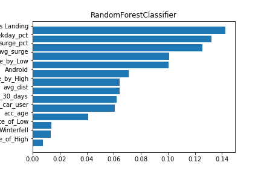
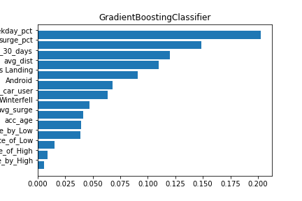
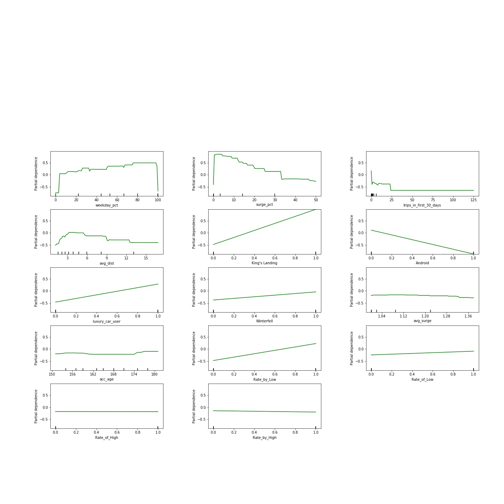

##Customer Churn Case Study

The problem is to design a prediction model for customer churn. The response variable are classified as 1 if the customer stays active within the past month or 0 if the customer churns (takes no trip during the past month). 
Prelim EDA involves dummifying categorical columns and creating new columns based on ratings information. Specifically, using median as a separator, ratings above the median are classified as "high_ratings" and ratings below are classified as "low_ratings" and no ratings are classified as "no_ratings" The rationale behind the split is that high ratings are generally happy about the experience and low_ratings are unhappy about the experience, by ignoring the distinction within each classification in hope to construction a flexible model (prevent overfitting). Another advantage is to classify NaN ratings (i.e "no ratings") as its own group, without having to drop the NaN rows for the SKlearn models to work, because we believe NaN ratings contain useful signals about customer behaviors.

Ratings distrtibution:

Model Scores:

Model: LogisticRegression
training accuarcy score: 0.746366666667
final test accuracy score:  0.7415
final test precision score: 0.682784108408
final test recall score: 0.587751855779
Confusion Matrix: [[TN FP][FN TP]]
[[5198 1030]
 [1555 2217]]
 
Model: RandomForestClassifier
training accuarcy score: 0.8151
final test accuracy score:  0.7739
final test precision score: 0.733395118937
final test recall score: 0.629374337222
Confusion Matrix: [[TN FP][FN TP]]
[[5365  863]
 [1398 2374]]
 
Model: GradientBoostingClassifier
training accuarcy score: 0.789366666667
final test accuracy score:  0.7783
final test precision score: 0.734398552909
final test recall score: 0.645811240721
Confusion Matrix: [[TN FP][FN TP]]
[[5347  881]
 [1336 2436]]
 
Random Forest and Gradient Boosting perform closely in terms test scores. Thus we look more closely into their feature importance ranking. Both Gradient Boosting and Random Forest share weekday_pct and surge_pct in top three important features.
Note:
Weekday_pct: % of trips a user takes that are during weekdays
Surge_pct: % of trips a user takes that are in peak hours with price surge

Partial Dependence Graph for Gradient Boosting:
The partial dependence graph shows that weekday_pct has a positive relationship with customer retention and surge_pct has a negative relatinship with customer retention, which intuitively makes sense. People who take more weekday trips are likely regular users for work commute and stay active and those who paid more for surge price would feel it's too expensive thus stop using the service. 

