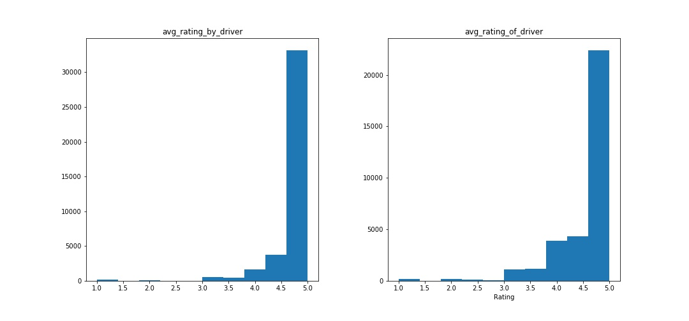

##Customer Churn Case Study

The problem is to design a prediction model for customer churn.
Prelim EDA involves dummifying categorical columns and creating new columns based on ratings information. Specifically, using median as a separator, ratings above the median are classified as "high_ratings" and ratings below are classified as "low_ratings" and no ratings are classified as "no_ratings" The rationale behind the split is that high ratings are generally happy about the experience and low_ratings are unhappy about the experience, by ignoring the distinction within each classification in hope to construction a flexible model (prevent overfitting). Another advantage is to classify NaN ratings (i.e "no ratings") as its own group, without having to drop the NaN rows for the SKlearn models to work, because we believe NaN ratings contain useful signals about customer behaviors.

